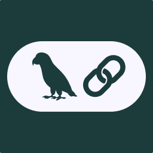
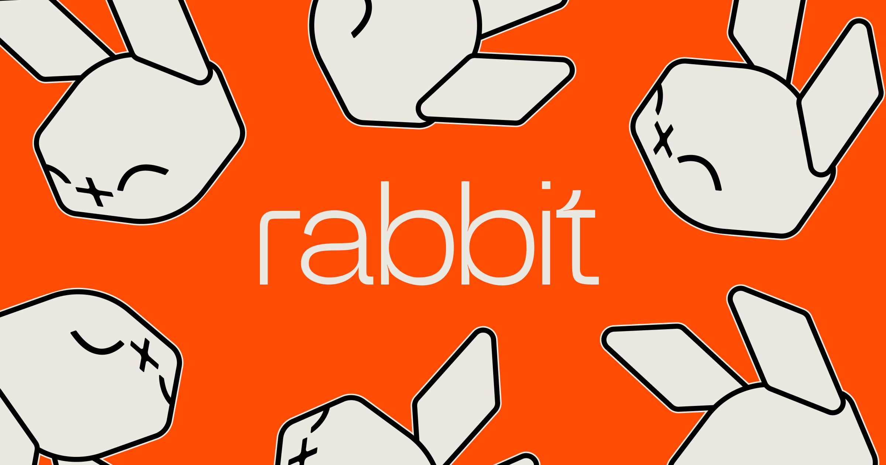
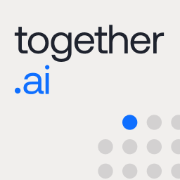
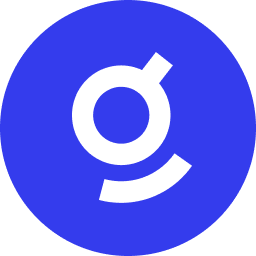
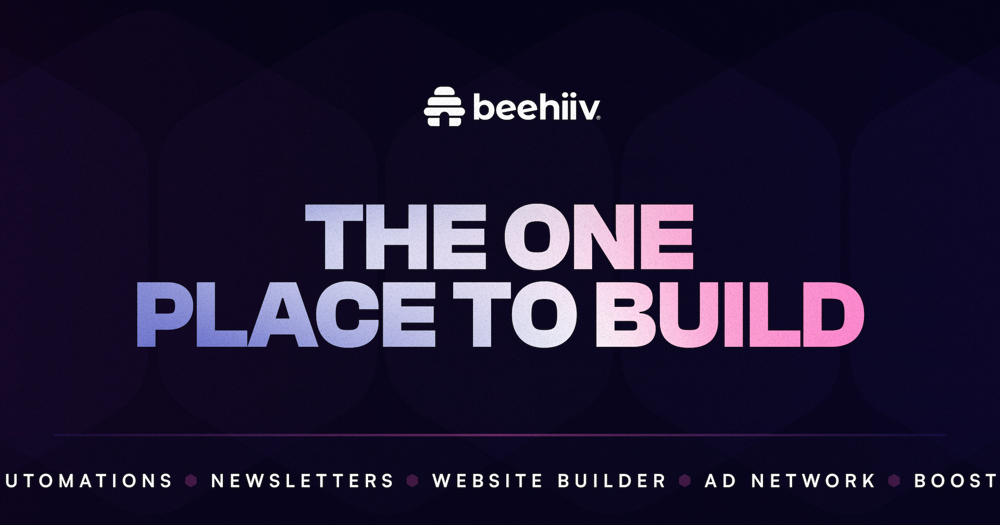
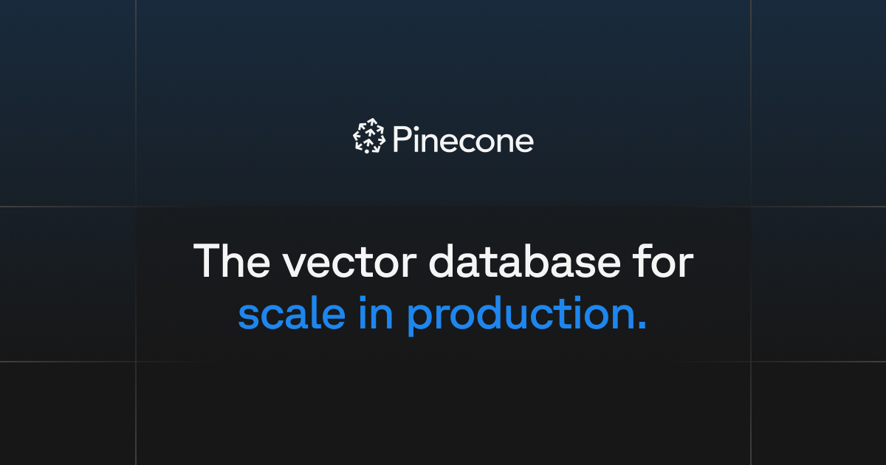
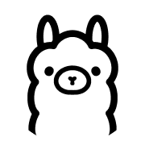
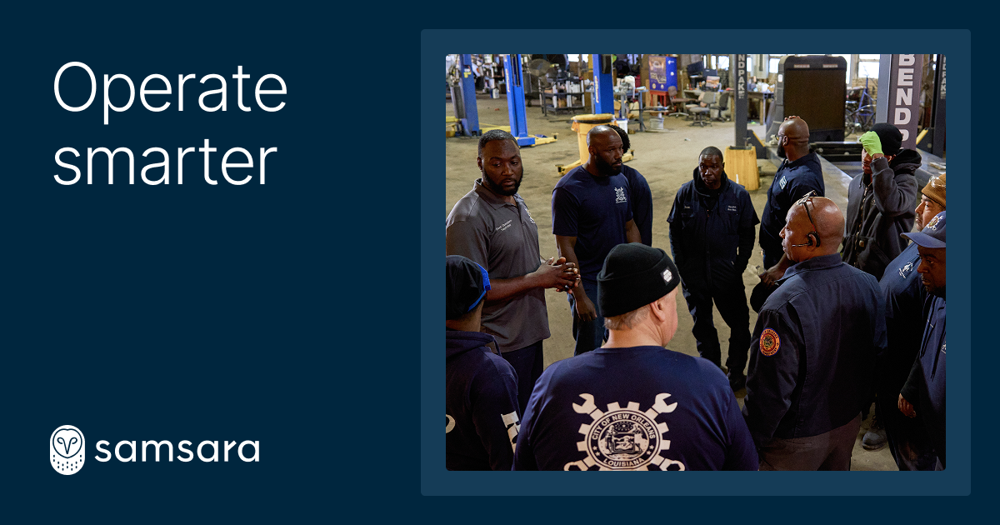

# The AI Founder's Go-to-Market Playbook

Welcome to the definitive go-to-market guide for AI founders. Traditional playbooks weren't built for the speed and nuance of AI. This framework is your strategic co-pilot, designed to help you navigate the 25 primary GTM channels.

> **A Note on Frameworks:** This playbook is heavily inspired by the Bullseye Framework from Gabriel Weinberg and Justin Mares' seminal book, *Traction*. While their framework is a timeless starting point for any startup, this guide adapts and extends it specifically for the unique challenges and opportunities of building in the fast-paced world of AI. We've updated the channels and added an AI-specific lens to the strategies.

**How to Use This Playbook:** As a founder, your resources are finite. This guide is structured to mirror your decision-making process.
1.  **Review the Table of Contents:** Get a high-level overview of the GTM categories and channels.
2.  **Jump to a Category:** Use the links to navigate to a relevant section.
3.  **Analyze Channels:** Within each category, review the individual channels. Use the filters (`Best For`, `Effort`, `Cost`) to prioritize what's relevant for you *right now*.
4.  **Get Inspired:** Look at the `Examples` and the **`How They Used It`** blurb to see who is winning with each channel.

---

## Table of Contents
- [**Community & Product**](#community--product)
  - [1. Product-Led Growth (PLG)](#1-product-led-growth-plg)
  - [2. Community-Led Growth](#2-community-led-growth)
  - [3. Waitlist Hype](#3-waitlist-hype)
  - [4. Engineering as Marketing](#4-engineering-as-marketing)
  - [5. Viral Marketing](#5-viral-marketing)
  - [6. Viral Loops](#6-viral-loops)
- [**Content & Brand**](#content--brand)
  - [7. Search Engine Optimization (SEO)](#7-search-engine-optimization-seo)
  - [8. Content Marketing](#8-content-marketing)
  - [9. Short-Form Video & Audio](#9-short-form-video--audio)
  - [10. Public Relations (PR)](#10-public-relations-pr)
  - [11. Unconventional PR](#11-unconventional-pr)
  - [12. Speaking Engagements](#12-speaking-engagements)
- [**Paid Acquisition**](#paid-acquisition)
  - [13. Search Engine Marketing (SEM)](#13-search-engine-marketing-sem)
  - [14. Social & Display Ads](#14-social--display-ads)
- [**Targeted Acquisition**](#targeted-acquisition)
  - [15. Sales](#15-sales)
  - [16. Email Marketing](#16-email-marketing)
  - [17. Targeting Blogs](#17-targeting-blogs)
- [**Ecosystem & Partnerships**](#ecosystem--partnerships)
  - [18. Cloud Marketplaces](#18-cloud-marketplaces)
  - [19. Influencer & Creator Ecosystems](#19-influencer--creator-ecosystems)
  - [20. Business Development](#20-business-development)
  - [21. Affiliate Programs](#21-affiliate-programs)
  - [22. Existing Platforms](#22-existing-platforms)
- [**Physical & High-Touch**](#physical--high-touch)
  - [23. Trade Shows](#23-trade-shows)
  - [24. Offline Events](#24-offline-events)
  - [25. Offline Ads](#25-offline-ads)

---

| Category | Channel | Description | Best For | Effort | Cost | Key Metrics | Trap to Avoid | Tools | Logo | Example | How They Used It |
| :--- | :--- | :--- | :--- | :--- | :--- | :--- | :--- | :--- | :---: | :--- | :--- |
| **Community & Product** | **Product-Led Growth (PLG)** | The product itself drives user acquisition through a compelling free tier or self-service trial. | All (esp. B2B, DevTool) | **High** | **Medium** | Activation Rate, Free-to-Paid % | Giving away too much value in the free tier, leaving no compelling reason to upgrade. | Pendo, Amplitude |  | [Perplexity AI](https://perplexity.ai) | Offered a powerful, free search product that became an indispensable utility, driving users to their paid "Pro" tier. |
| **Community & Product** | **Community-Led Growth** | Fosters a vibrant community (e.g., on Discord) that becomes the primary engine for feedback, support, and organic growth. | DevTool, B2C | **Medium** | **Low** | Active Members (DAU/MAU), Contributions | Treating the community like a broadcast channel. It's a two-way street; listen more than you talk. | Discord, Slack |  | [LangChain](https://langchain.com) | Built one of the most active Discord servers in AI, making it the central hub for developers to learn and get help. |
| **Community & Product**| **Waitlist Hype**| Builds massive anticipation and an initial user base before launch through an exclusive, often viral, waitlist. | B2C, DevTool| **High**| **Medium**| Waitlist Velocity, Social Mentions| A buggy or underwhelming launch day experience that destroys all the pre-built anticipation. | Viral Loops, Typeform| | [Rabbit](https://www.rabbit.tech)| Generated enormous hype with a single, polished keynote video, driving millions of pre-orders and waitlist signups. |
| **Community & Product** | **Engineering as Marketing** | Builds free tools and open-source models that solve problems for developers, creating a funnel to paid products. | DevTool, B2B | **Medium** | **Low** | # of Stars/Forks, # of API calls | Building a cool tool that doesn't solve a painful, validated problem for your target audience. | GitHub, Vercel |  | [Together AI](https://www.together.ai) | Released high-quality open-source models and an inference stack, establishing credibility and attracting developers to their paid API. |
| **Community & Product** | **Viral Marketing** | Designs the product where performance or output is so impressive users are compelled to share it, creating organic buzz. | DevTool, B2B, B2C | **Medium** | **Low** | Demo Shares, Social Mentions | Confusing a one-time viral spike with a sustainable, product-driven growth loop. | X, Built-in Demos |  | [Groq](https://groq.com) | Their public demo showcasing mind-blowing inference speed went viral on X, generating massive developer interest overnight. |
| **Community & Product** | **Viral Loops** | Builds self-perpetuating mechanisms into the product, such as referral bonuses or collaborative features. | B2C, B2B | **Medium** | **Low** | Referral Invites Sent, New Users | Asking for a referral before the user has experienced the core "aha!" moment of your product. | ReferralCandy, PartnerStack |  | [Gamma](https://gamma.app) | Offered users extra credits for referring new users, creating a simple, effective incentive loop to drive growth. |
| **Content & Brand** | **Search Engine Optimization (SEO)** | Creates authoritative content optimized to be a primary source for AI-powered search engines and LLMs. | All | **Medium** | **Low** | Organic Traffic, High-Intent Keywords | Chasing high-volume vanity keywords instead of high-intent keywords that signal a problem. | Ahrefs, SEMrush |  | [Jasper](https://www.jasper.ai) | Dominated early search results for "AI writer" and related keywords, capturing massive inbound interest. |
| **Content & Brand** | **Content Marketing** | Educates the market with high-quality documentation, research, blog posts, and case studies. | All | **Medium** | **Low** | Signups from Content, Time on Page | Writing about your product features instead of your customers' problems and solutions. | Notion, Ghost |  | [Google DeepMind](https://deepmind.google) | Publishes industry-leading research papers and technical blogs, establishing themselves as the authority in AI research. |
| **Content & Brand**| **Short-Form Video & Audio** | Uses TikTok, Reels, etc. to capture attention with "building in public" content, demos, and thought leadership. | B2C, B2B | **Medium** | **Low** | Views & Engagement, Website Clicks | Trying to go viral with trends instead of creating genuinely helpful or impressive content. | TikTok, Descript |  | [Blotato](https://blotato.com) | The founder authentically documents the startup journey on TikTok and X, building a loyal following. |
| **Content & Brand** | **Public Relations (PR)** | Shapes the public narrative and establishes executives as thought leaders on key AI trends and ethics. | B2B, B2C | **Medium** | **High** | High-Authority Backlinks, Share of Voice | Paying a costly PR agency before you have a clear, compelling story to tell. | Muck Rack, Cision |  | [Anthropic](https://www.anthropic.com) | Positioned themselves as the safety-conscious AI research lab, creating a strong brand narrative in the media. |
| **Content & Brand** | **Unconventional PR** | Executes memorable "intelligence stunts" or creative drops that generate massive organic buzz and media coverage. | B2C, B2B, DevTool | **High** | **Medium** | Media Mentions, Social Buzz, # of Participants | Executing a stunt that is clever but doesn't clearly communicate your product's core value. | Creative strategy |  | [Bolt](https://bolt.new) | Organized the 'largest AI hackathon ever,' a massive event that attracted thousands of developers and instantly established them as a key player. |
| **Content & Brand** | **Speaking Engagements** | Establishes thought leadership by securing speaking slots at key industry conferences to share unique insights. | B2B, DevTool | **Medium** | **Medium** | Leads from Event, Audience Questions | Giving a sales pitch on stage. Instead, teach something valuable and earn the audience's trust. | PaperCall.io |  | [LangChain](https://langchain.com) | The founder, Harrison Chase, is a constant presence at AI events, making him the face of the LLM developer movement. |
| **Paid Acquisition** | **Search Engine Marketing (SEM)** | **Captures existing intent** by targeting users actively searching for solutions on platforms like Google. | B2B, B2C | **Medium** | **High** | CAC, LTV, ROAS (Return on Ad Spend) | Scaling ad spend before you have a clear understanding of your ideal customer and unit economics. | Google Ads |  | [Writesonic](https://writesonic.com) | Bids on high-intent keywords like "AI content generator," directly competing for customers against Jasper and others. |
| **Paid Acquisition** | **Social & Display Ads** | **Creates new demand** by targeting users based on interests and profiles, interrupting their feed to build awareness. | B2C, B2B | **Medium** | **High** | Cost per Lead (CPL), CTR | Targeting a broad audience instead of obsessively narrowing down to a niche that feels the pain. | Meta/LinkedIn Ads |  | [Copy.ai](https://www.copy.ai) | Runs targeted ads to writers, marketers, and founders on platforms like Facebook and LinkedIn. |
| **Targeted Acquisition** | **Sales** | Augments the sales team with AI tools for lead scoring, personalized outreach, and real-time insights. | B2B | **High** | **High** | ACV (Annual Contract Value), Win Rate | Hiring a sales team before you, the founder, have personally closed the first 10-15 deals. | Salesforce, Gong |  | [Glean](https://www.glean.com) | Deploys a sophisticated enterprise sales team to sell their high-ACV AI search product to large companies. |
| **Targeted Acquisition** | **Email Marketing** | Uses AI to automate and personalize email campaigns based on user behavior, optimizing content and send times. | All | **Low** | **Low** | Open Rate, Click-Through Rate | Sending generic marketing blasts instead of behavior-triggered, personalized emails. | Customer.io |  | [Rewind AI](https://www.rewind.ai) | Masterfully used email to nurture their massive waitlist, keeping users engaged until launch day. |
| **Targeted Acquisition** | **Targeting Blogs** | Uses AI to identify and personalize outreach to niche blogs and newsletters with highly engaged, relevant audiences. | All | **Medium** | **Low** | Response Rate, # of Demos/Signups | Sending a generic, templated outreach email. Personalize every single one. | BuzzSumo, Hunter |  | [beehiiv](https://www.beehiiv.com) | Grew by targeting Substack writers and influential creators, convincing them to switch platforms. |
| **Ecosystem & Partnerships** | **Cloud Marketplaces** | Integrates with AWS, Azure, or GCP marketplaces to simplify procurement and billing for enterprise customers. | B2B | **High** | **Medium** | Revenue from Marketplace, Deployments | Underestimating the technical and security requirements needed to get listed and stay current. | AWS Marketplace |  | [Pinecone](https://www.pinecone.io) | Is listed on AWS & GCP, making it frictionless for enterprises to purchase and deploy their vector database. |
| **Ecosystem & Partnerships** | **Influencer & Creator Ecosystems** | Partners with tech influencers on platforms like YouTube to produce authentic tutorials and reviews for niche audiences. | DevTool, B2C | **Medium** | **Medium** | Referral Traffic, Direct Conversions | Dictating the creative to an influencer. Trust them to know their audience and give them freedom. | Grin, Upfluence |  | [Runway](https://runwayml.com) | Empowered AI artists and video creators to showcase the platform's power, turning them into evangelists. |
| **Ecosystem & Partnerships**| **Business Development** | Forges strategic alliances with companies that offer complementary technologies or have access to large user bases. | B2B | **High** | **Medium** | # of Qualified Leads from Partners | Seeking partnerships with large companies too early. Focus on partners your own size first. | Crossbeam |  | [Mistral AI](https://mistral.ai) | Secured a key strategic partnership with Microsoft Azure for massive distribution and enterprise credibility. |
| **Ecosystem & Partnerships** | **Affiliate Programs** | Incentivizes developers and creators in the AI ecosystem to refer new customers through a commission-based structure. | B2C, B2B | **Medium** | **Medium** | # of Active Affiliates, Revenue/Affiliate | Launching a program and expecting affiliates to show up. You need to actively recruit them. | PartnerStack |  | [AssemblyAI](https://www.assemblyai.com) | Offers a partner program for developers who build applications on top of their speech-to-text API. |
| **Ecosystem & Partnerships** | **Existing Platforms** | Builds apps and integrations for platforms where users already work, like Slack, Figma, or VS Code. | All | **High** | **Low** | # of Installs/Integrations, Active Users | Building a shallow integration. A great integration feels like a native part of the host platform. | Postman, SDKs |  | [Ollama](https://ollama.com) | Integrates seamlessly with tools like Docker and has a popular VS Code extension, meeting developers where they are. |
| **Physical & High-Touch** | **Trade Shows** | Offers high-touch, interactive experiences at industry events with live AI demos, workshops, and hackathons. | B2B | **High** | **High** | # of Qualified Booth Leads, Cost per Lead | Just scanning badges. Your only goal should be to book qualified meetings for the following week. | Bizzabo, Cvent |  | [Together AI](https://www.together.ai) | Maintains a significant presence at major AI and developer conferences to engage with high-value enterprise customers. |
| **Physical & High-Touch** | **Offline Events** | Fosters a strong local community by hosting or sponsoring meetups, workshops, and hackathons for direct user engagement. | DevTool, B2B | **Medium** | **Low** | # of Attendees, Quality of Conversations | Hosting an event without a clear goal. Is it for recruiting, user feedback, or lead generation? | Luma, Meetup |  | [Luma](https://lu.ma) | As a tool for events, they "dogfood" their own product, hosting and sponsoring events to build their community. |
| **Physical & High-Touch** | **Offline Ads** | Bridges the physical and digital worlds by using offline media to drive traffic to an interactive AI-powered experience. | B2C, B2B | **Low** | **High** | Direct Traffic from URL/QR, Brand Recall | Spending money on offline ads without a clear, measurable call to action. | QR Code Gen |  | [Samsara](https://www.samsara.com) | Uses billboards on major highways to target the trucking and logistics companies that are their ideal customers. |

---

## Questions / Feedback

Find a channel missing? Have a better example? Disagree with a take? I'd love to hear from you.

- **LinkedIn:** [linkedin.com/in/goabego](https://linkedin.com/in/goabego)
- **X/Twitter:** [x.com/goabegoo](https://x.com/goabegoo)